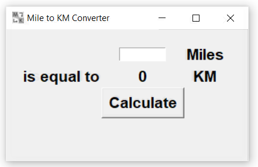

# 📏 Miles to KM Converter – A Simple Python Unit Conversion App

**Miles to KM Converter** is a clean, beginner-friendly desktop app to help you quickly convert distance from miles to kilometers.  
It’s designed to be super lightweight and instantly usable — perfect for quick tasks, basic needs, or Python learning practice.

---

**The Mission:**  
This mini tool helps users make quick distance conversions without needing to search online or use calculators.  
It's especially useful for students, travelers, or anyone dealing with mixed measurement systems.

---

## 💻 Download for Windows

🔗 [Download Now!](https://github.com/mshikebkhan/miles-to-km-converter/releases/download/v1.0.0/MilesToKm.Converter.exe)

---

## 🚀 Features

📏 Instant Conversion – Just enter miles and get kilometers with a click.  
⚡ Super Fast – No loading, no fluff, just pure functionality.  
🧠 Beginner-Friendly – Great example for those learning Tkinter or GUIs.  
📦 Lightweight – Tiny `.exe` size, no installation needed.  
🖥️ Standalone App – Runs directly on Windows with no setup.

---

## 📸 Screenshots

| Screenshot | Description |
|------------|-------------|
|  | Converter Window – Simple input and output design |

---

## 🛠 Tech Stack

- **Language:** Python  
- **GUI:** Tkinter  
- **Build Tool:** PyInstaller

---

## ⚙️ Local Setup

```bash
git clone https://github.com/yourusername/miles-to-km-converter.git
cd miles-to-km-converter
python -m venv venv
venv\Scripts\activate         # For Windows
pip install -r requirements.txt
python main.py
```
---

## 👥 Contributing

1. Fork the repository
2. Create your feature branch: `git checkout -b feature-name`
3. Commit your changes
4. Push to your branch
5. Open a Pull Request 🚀

---

## 📌 TODO Ideas

- Add KM to Miles Converting Option
- Or anything else you think of!

---

## 📄 License

[MIT License](LICENSE)

---

Made with ❤️ by Shikeb Khan
